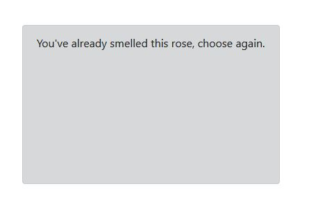

Deployed at GitPages here  https://amandaamos.github.io/ClicketyClick/.

## Roses Clicky Game

Don't click the same rose twice!  
In this memory game, the player clicks on a different variety each time.  The player wins when they get up to 12.  Each time they click a duplicate picture, the score resets. 

## Technologies
**Mongo/Mongoose**
 
**Express**
 
**React**
 
**Node**
 

**Bootstrap**
 

 **Don't click twice or you'll get an alert!**
  
 

**Click all of the Roses one time each and you win!**

Created for UA Full Stack Web Development BootCamp

